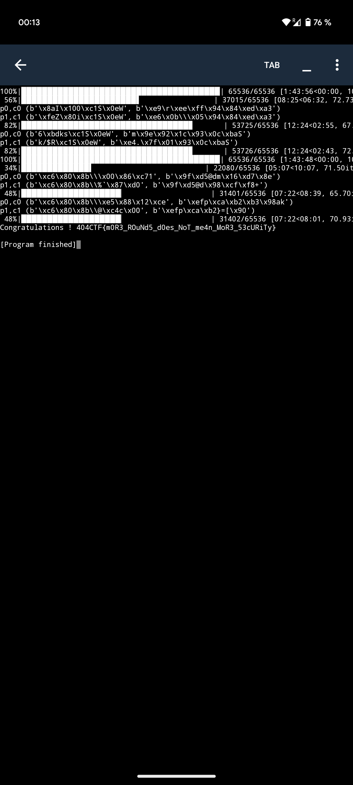

# J'ai glissé chef !
## Category
Crypto
## Difficulty
Hard/Extreme
## Statement

I was packing my things by the pool after my swimming session and I dropped my keys to the bottom of the deep pool...
Help me retrieve them!

Note: the solution might take a little bit of time.
## Resources

[feistel.py](feistel.py)

## Author
**acmo0**

# Solution Idea

We are dealing with encryption based on a Feistel network here. The first noticeable aspect is that it comprises 96 rounds, making differential or algebraic attacks highly unlikely. Similarly, the SBOX is that of Rijndael, so there are no vulnerabilities on that front. We also have access to an encryption and decryption oracle, which can be used up to a little more than 2^18 times. Thus, we can apply a slide attack, as suggested by the challenge title.

We will apply a variant of this [attack](https://link.springer.com/content/pdf/10.1007/3-540-48519-8_18.pdf).

The difference here is that we have two different round keys. So, we will use the decryption oracle as an encryption oracle on the second plaintext to find the "slid pair."

For the second round key, it's the same process but in reverse.

False positives can occur. To eliminate them, simply apply the function that retrieves the key to the plaintexts, then to the ciphertexts of the slid pair, and compare. If the output is different, it is a false positive and we must continue the search.

