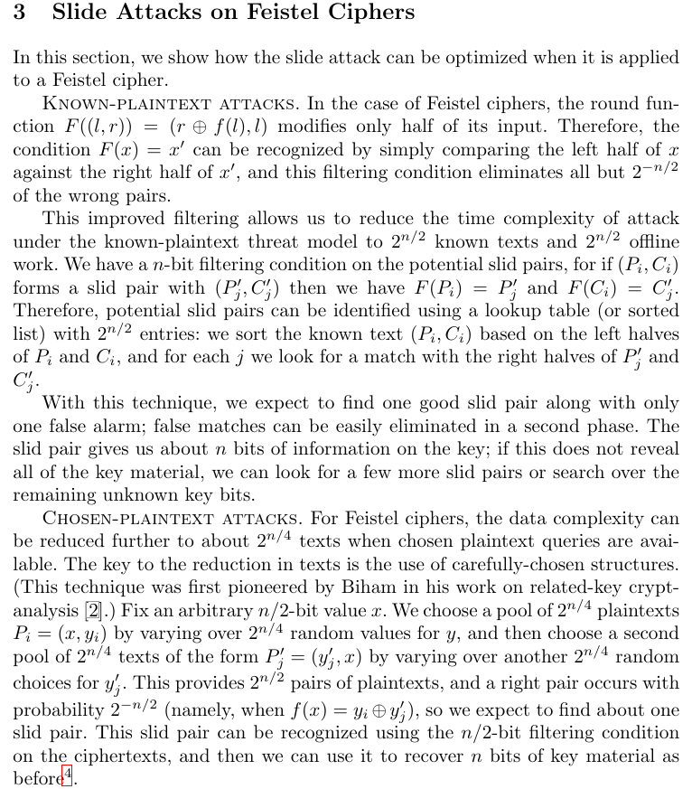

# J'ai glissé chef !
## Catégorie
Crypto
## Difficulté
Difficile/Extrême
## Énoncé

Je rangeais mes affaires au bord du bassin après ma séance de natation et j'ai fait tomber mes clés au fond du grand bassin...
Aidez-moi à les récupérer !

Note : la résolution peut prendre un petit peu de temps
## Ressources

[feistel.py](feistel.py)

## Auteur
**acmo0**

# Idée de la solution

Nous sommes ici face à un chiffrement basé sur un réseau de Feistel. La première chose qui interpelle est qu'il est composé de 96 tours, ce qui rend invraisemblable la possibilité d'une attaque différentielle ou algébrique. De même, la SBOX est celle de Rijndael, donc aucune vulnérabilité de ce côté. Nous avons également accès à un oracle de chiffrement et de déchiffrement utilisable au maximum un peu plus de 2^18 fois. On peut donc ainsi appliquer une attaque par glissement, comme le laisse entendre le titre du challenge.

Nous allons appliquer une variante de cette [attaque](https://link.springer.com/content/pdf/10.1007/3-540-48519-8_18.pdf).

À la différence près que l'on a deux clés de tour différentes. On va donc utiliser l'oracle de déchiffrement comme un oracle de chiffrement sur le deuxième clair pour trouver la "slid pair".

Pour la deuxième clé de tour, c'est la même chose mais inversement.

On peut d'ailleurs tomber sur des faux positifs. Pour les éliminer, il suffit d'appliquer la fonction qui permet de retrouver la clé aux clairs, puis aux chiffres de la slid pair, puis de comparer. Si l'output est différent, c'est alors un faux positif et on doit continuer la recherche.

