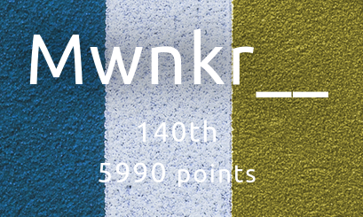
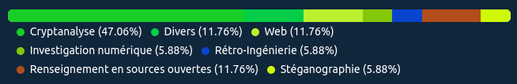

## Présentation

Le 404CTF-2024 est la troisième édition du 404CTF, coorganisée par la DGSE, Télécom SudParis, HackademINT, OVHcloud et Viva Technology. L'édition 2024 s'est tenue du 20 avril au 12 mai 2024 et a rassemblé plus de 3000 participants autour de 72 challenges conçus par HackademINT.

La plupart des challenges ont été rendus public par le club HackademINT ainsi que leur solution [ici](https://github.com/HackademINT/404CTF-2024).

## Contexte

Ici se trouve mon résultat et le détail de ma participation au 404CTF. Se fut une très belle expérience malgré que la dernière semaine de compétition coincide avec mes vacances ce qui m'empêcha d'aborder les nouveaux challenges rajoutés à ce moment-là.

N'étant pas un habitué de ce genre de compétition ma manière de résoudre les problèmes n'est pas très "write-up friendly". Beaucoup de challenge ont été résolu "avec papier/crayon" et [dcode](dcode.fr) ou l'ordinateur servait globalement de calculatrice si je puis dire.

## Résultat personnel

**Classement :** 140ème / 3791

**Score final :** 5990 points

## Challenges 

Tous les challenges ont un score de base de 1000 points, à l'exception des challenges d'introduction ayant un score de 100 points.  
Ce score diminue en fonction du nombre de validation afin de rééquilibrer les challenges selon leur difficulté.  
Le nombre de points d'un challenge ne peut pas descendre en dessous de 200 points. Les challenges d'introduction ne sont pas soumis à ce rééquilibrage.

### Première vague de challenges du 20 Avril au 12 Mai

| Nom | Catégorie | Nombre de points | Nombre de validations | Résolu |
| - | - | - | - | - |
| **Cryptanalyse** |
| [Bébé nageur](./BebeNageur/) | 🟦 Intro | 100 points | 1152 validations | ✔ |
| Le petit bain | 🟩 Facile | 200 points | 254 validations | ✔ |
| [Poor Random Number Generator 1 ](./PRNG%201/) | 🟩 Facile | 271 points | 192 validations | ✔ |
| [Plongeon Rapide Super Artistique](./PlongeonRapideSuperArtistique/) | 🟧 Moyen | 698 points | 124 validations | ✔ |
| [J'éponge donc j'essuie](./JepongeDoncJessuie/) | 🟧 Moyen | 891 points | 75 validations | ✔ |
| [Poor Random Number Generator 2 ](./PRNG%202/) | 🟧 Moyen | 956 points | 48 validations | ✔ |
| [La Seine](./La%20Seine/) | 🟥 Difficile | 968 points | 41 validations | ✔ |
| [J'ai glissé chef](./JaiGlisseChef/) ! | 🟥 Difficile | 996 points | 16 validations | ✔  |
| SEA - La face cachée de l'Iceberg | 🟥 Difficile | 999 points | 9 validations | ❌ |

### Deuxième vague de challenges du 05 Mai au 12 Mai (après mon départ en vacances)

| Nom | Catégorie | Nombre de points | Nombre de validations | Résolu |
| - | - | - | - | - |
| **Cryptanalyse** |
| Zack Adeaux | 🟧 Moyen | 967 points | 42 validations | 🏖️ |
| RSAlade-tomatECC-oigNPon | 🟥 Difficile | 1000 points | 7 validations | 🏖️ |
| La Brasse ou Le Papillon ? | 🟪 Extrême | 1000 points | 1 validation | 🏖️ |
